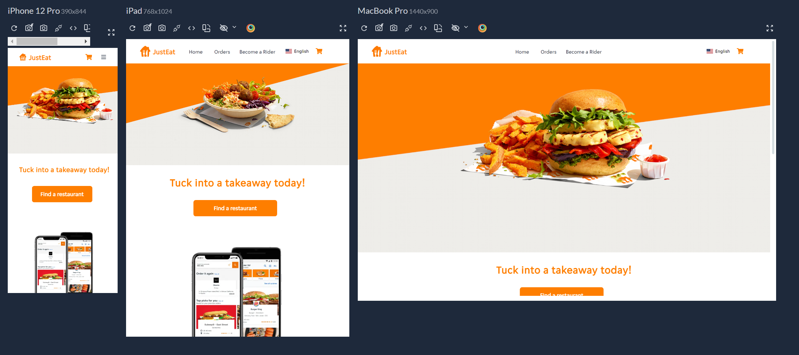
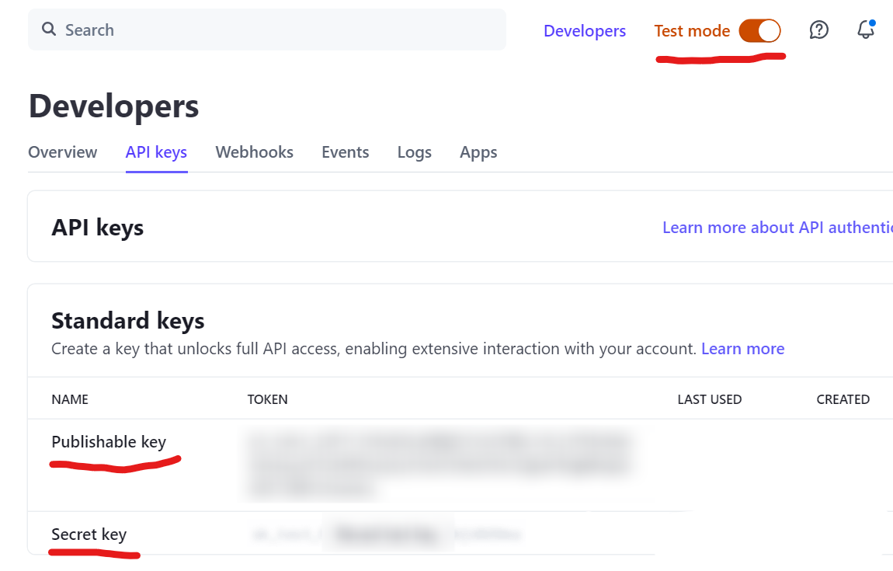
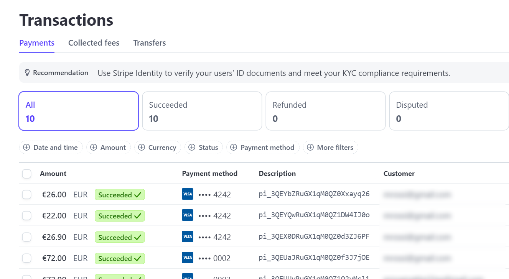

# Just Eat - Clone

## Description
This project is a clone of the well-known food delivery app, developed using React.js, Next.js, TypeScript, Tailwind CSS, Redux Toolkit, and much more!



## Dependencies Installation and Node Modules

Make sure you already have [Node js](https://nodejs.org/it/download/) installed before proceeding. Then, install the necessary node modules to start the application

```sh
  npm install
```

## .env File and Stripe configuration
- Log into your Stripe account or create a new one if you haven’t already.
- Configure your test [API keys](https://dashboard.stripe.com/test/apikeys) in the _.env_ file as shown below:

```JavaScript
  BASE_URL=http://localhost:3000
  NEXT_PUBLIC_STRIPE_PUBLIC_KEY=pk_test_51P..
  STRIPE_SECRET_KEY=sk_test_51P..
```


Check all transactions [here](https://dashboard.stripe.com/test/payments)



## How to run the application

After installing all the necessary dependencies, you can now proceed with launching the application using the command:

```sh
  npm dev
```

Connect to [http://localhost:3000/](http://localhost:3000) to view the application


## Automation testing with [Playwright]((https://playwright.dev/docs/intro)) in your project. 
Before running Playwright tests, make sure your application is running.
Run all tests in your project with a single command:

```sh
  npm run test
```

## Technologies used

- React js
- Next js
- Tailwind CSS, Shadcn UI
- Redux Toolkit
- eslint
- [react-amazing-hooks](https://github.com/mattiach/react-amazing-hooks) 👈🏻 made with love by me! 😄
- next-intl, formik, slick-carousel, tailwind-merge and many other JS libraries..
- Playwright

## Author and rights

Designed and written by [Mattia](https://www.linkedin.com/in/mattiach/).

The application can be downloaded and freely modified by anyone! 😊
Any suggestions or improvements will be appreciated.
