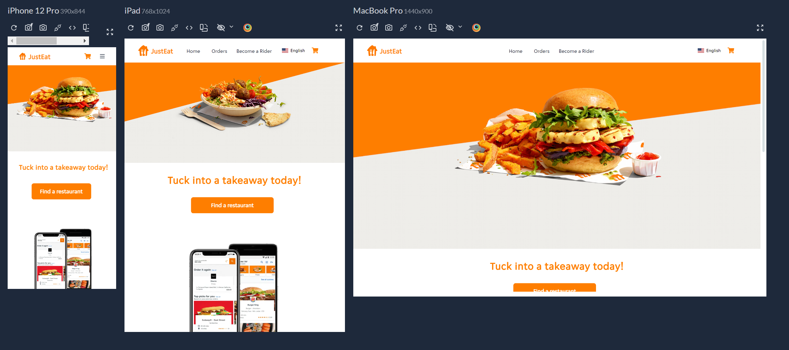

# Just Eat - Clone

## Description
This project is a clone of the well-known food delivery app, developed using React.js, Next.js, TypeScript, Tailwind CSS, Redux Toolkit, and much more!



## Dependencies Installation and Node Modules

Make sure you already have [Node js](https://nodejs.org/it/download/) installed before proceeding. Then, install the necessary node modules to start the application

```sh
npm install
```

## How to run the application

After installing all the necessary dependencies, you can now proceed with launching the application using the command:

```sh
npm start
```

Connect to [http://localhost:3000/](http://localhost:3000) to view the application

## Technologies used

- React js
- Next js
- Tailwind CSS, DaisyUI
- Redux Toolkit
- eslint
- [react-amazing-hooks](https://github.com/mattiach/react-amazing-hooks) 👈🏻 made with love by me! 😄
- next-intl, formik, slick-carousel, tailwind-merge and many other JS libraries..

## Author and rights

Designed and written by [Mattia](https://www.linkedin.com/in/mattiach/).

The application can be downloaded and freely modified by anyone! 😊
Any suggestions or improvements will be appreciated.
